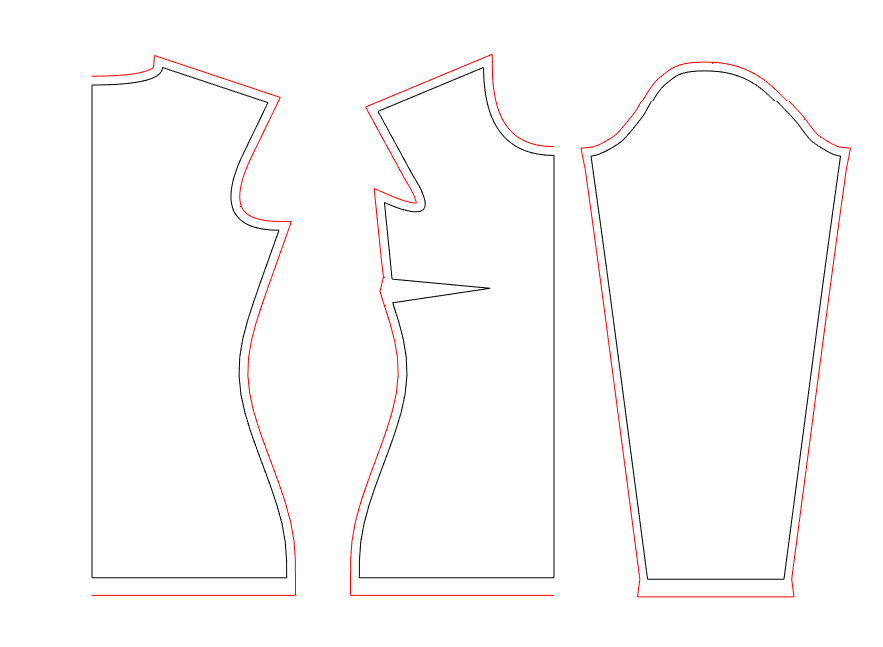

# shirt
Create a tailor-made pattern for a shirt written in Matlab

## For what purpose can I use the pattern?
Maybe sewing is your hobby and you want to sew a perfectly fitting garment for yourself or a friend.

Or you are interested in a perfectly fitting garment for a more technical reason. For example, you develop smart textiles and need a constant contact pressure for your sensors.

The functions presented here allow you to create the basic cutting pattern for a shirt, which you can then be modified as you like.

The following options are already included:
* Gender: Lady, Men
* Fit: wide, regular, slim
* neckline: Round neck, v-neckline
* sleeves: sleeveless, short, 3/4 sleeves, long

## Which kind of files do I get and how can I use the pattern to cut the fabric?
The pattern will be written into a SVG-file. This file can be transferred directly to a laser cutter for cutting. But if you don't have access to such a machine, you can also plot the file on paper and transfer it to the fabric as usual.

## What do I need...
### ... to take the body dimensions?
* tape measure
* waistband
* one piece of paper

A [`dimension sheet`](/Dimensionsheet.pdf) including a tutorial how to take the measurements is avaible.

### ... to run the code on my computer?

Matlab (2018b or newer) with Computer Vision Toolbox

SG Library (https://github.com/timlueth/SG-Lib-Matlab-Toolbox)

## Usage

See [`Example.m`](./Example.m)

## References
* Vivien Altmann: Schnittmuster für elastische Stoffe erstellen 1: Grundschnitt für T-Shirts, Online Tutorial https://www.makerist.de/courses/schnittmuster-fuer-elastische-stoffe-erstellen-1-grundschnitt-fuer-t-shirts.
* Guido Hofenbitzer (2009): Schnittkonstruktion für Damenmode: Bekleidung : Grundlagen, Band 1, Verlag Europa-Lehrmittel Nourney, Vollmer, 368 Seiten.

## Thank you

* Prof. Dr. Lüth [@timlueth](https://github.com/timlueth) for the introduction of data types like point lists (PL) and closed point lists (CPL) and of course for the provision of a large number of functions to handle them within the SG-Library.
* Dr. Matthias Träger for the basic code for the generation of SVG files from point lists (see function [`PLwriteSVG2`](./PLwriteSVG2.m)).
